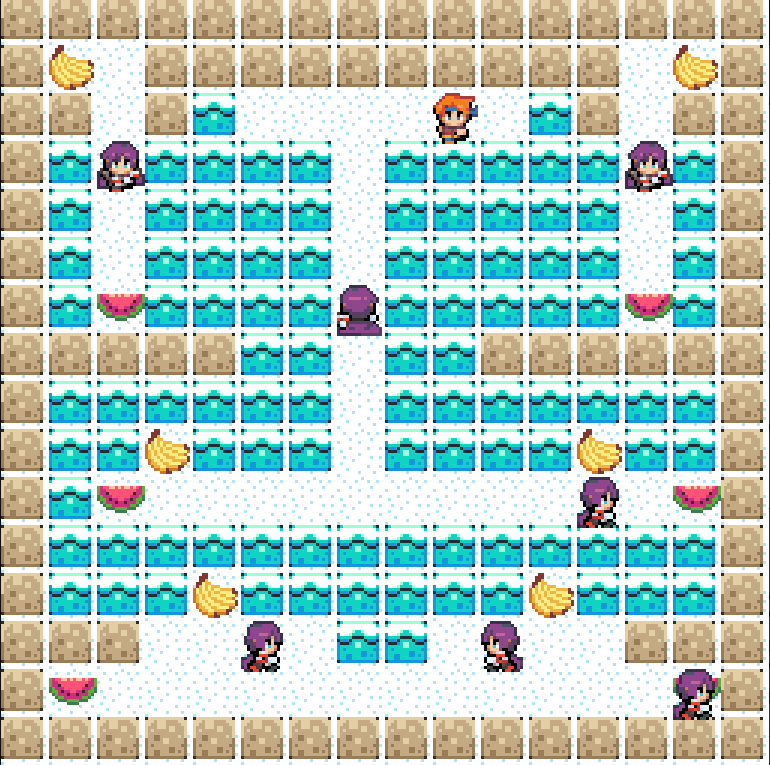

# Game Description

Our game is a top-down arcade inspired by the game Bad Ice Cream. In this game the player has to collect fruits, without getting caught by the monsters, in order to win the game.

## IMPLEMENTED FEATURES

- **Main Menu** - menu screen that appears when the game initializes. Allows the user to start or quit the game.
- **Level Loader** - loads the levels from a text file and creates the game objects accordingly, making it easy to add new levels.
- **Player Movement** - the player can move in four directions (up, down, left, right) using the arrows keys.
- **Build And Break Ice Walls** - the player can create and break ice walls in the direction he is facing to modify the environment and change game dynamics.
- **Collect Fruits** - the player can collect fruits to increase his score and complete the level or the game.
- **Death Condition** - the player dies when he collides with an enemy.
- **Credits Menu** - when the player dies or completes the game a credits screen appears with the fruits collected and the options to restart or quit the game.

### Controls
```ArrowUp``` : Moves the player up.

```ArrowDown``` : Moves the player down.

```ArrowRight``` : Moves the player right.

```ArrowLeft``` : Moves the player left.

```E``` : Build IceWall.

```F``` : Break IceWall.

```Enter``` : Select.

```Q``` : Quit the game.

### Game Screenshots

<p align="center">

</p>

<p align="center">

</p>

<p align="center">

</p>

<p align="center">

</p>

<p align="center">

</p>


### Developed by

* João Cova; 
* Francisco Fonte;
