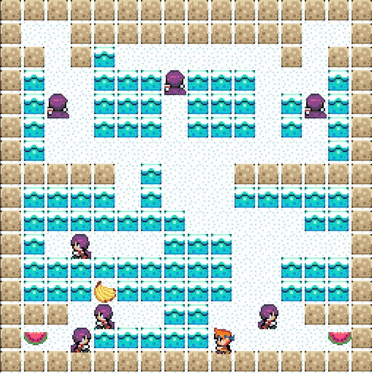
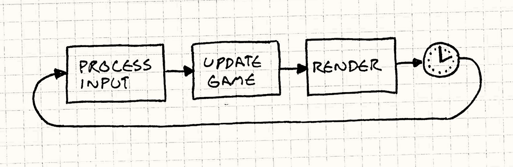
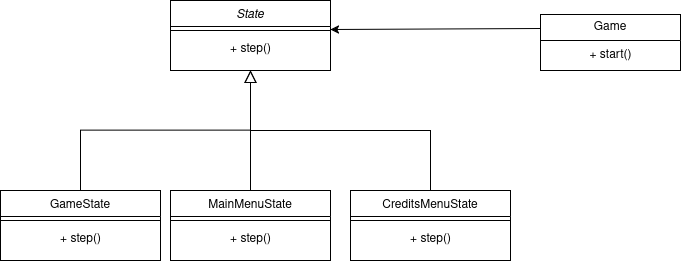

<h2 align="center">LDTS_T01G07 - Bad Ice-Cream</h2>

## Game Description

Bad Ice-Cream is a 2D arcade game with some fun puzzle-platformed mechanics.
The main character must collect fruits in a maze environment while avoiding enemies throughout the levels.
He can also build ice walls to block enemies and break them to create new paths.

This project was developed by Francisco Fonte (up202305597) and João Vila Cova (up202307756) for LDTS 2024/2025.

## IMPLEMENTED FEATURES

- **Main Menu** - menu screen that appears when the game initializes. Allows the user to start or quit the game.
- **Level Loader** - loads the levels from a text file and creates the game objects accordingly, making it easy to add new levels.
- **Player Movement** - the player can move in four directions (up, down, left, right) using the arrows keys.
- **Build And Break Ice Walls** - the player can create and break ice walls in the direction he is facing to modify the environment and change game dynamics.
- **Collect Fruits** - the player can collect fruits to increase his score and complete the level or the game.
- **Death Condition** - the player dies when he collides with an enemy.
- **Credits Menu** - when the player dies or completes the game a credits screen appears with the fruits collected and the options to restart or quit the game.

## PLANNED FEATURES

When developing the game, and after making some enemies behavior, one idea was making some enemies following the player but implementing it would require more complexity to the game, and with the addition of ice walls, the enemy's behavior would be buggy and hard to predict.
Another planned feature was adding a portal/door that would teleport the player to another level when collected all fruits, but it was not implemented due to time constraints.

## UML Of The Project

## DESIGN

### General Structure

#### Problem in Context

The game required a modular architecture to separate the logic for
game mechanics, rendering, and user input. To help maintain
the Single Responsibility Principle, the code needs to be well-organized and separated.
In addition, it makes testing easier.

#### The Pattern

The MVC Pattern was chosen to separate the game into three sections:

- **Model** - responsible for the game's logic and data.
- **View** - responsible for rendering the game.
- **Controller** - responsible for handling user input and updating the model and view.

This pattern was a natural fit for the project and we used it since the beginning 
of the project because it helped us to separate what we wanted to implement.

#### Implementation

The implementation of the MVC pattern can be seen by the separation of the source code
having packages corresponding to each section.
Here is an example of the structure:

- [Model](https://github.com/FEUP-LDTS-2024/project-t01g07/blob/master/bad_icecream/src/main/java/badicecream/model/elements/characters/Player.java)
- [View](https://github.com/FEUP-LDTS-2024/project-t01g07/blob/master/bad_icecream/src/main/java/badicecream/view/game/characters/PlayerViewer.java)
- [Controller](https://github.com/FEUP-LDTS-2024/project-t01g07/blob/master/bad_icecream/src/main/java/badicecream/controller/game/PlayerController.java)

#### Consequences

Just like mentioned, this pattern helped us to separate the code
and make it easier to maintain and test. It also helped us to
maintain the Single Responsibility Principle.

### Game Loop

#### Problem in Context

A game requires continuous flow of logic to handle rendering, input processing,
and state updates. Initially the game did not follow a structured loop, but as the 
development progressed we wanted to make the game to render the game at a fixed rate and update the state
accordingly.

#### The Pattern

The Game Loop Pattern was chosen to ensure a consistent execution cycle.
A game loop runs continuously during gameplay. Each turn of the loop,
it processes user input without blocking, updates the game state, and renders the game.
There is also the FPS (frames per second) value that represents the number of times the image is updated to the screen in one second.

#### Implementation

The implementation of the game loop can be seen in the Game class:

[Game Loop](https://github.com/FEUP-LDTS-2024/project-t01g07/blob/master/bad_icecream/src/main/java/badicecream/Game.java)

The explanation can also be seen in the following image:

#### Consequences

Using the Game Loop pattern helped us to have consistent frame rate and 
execution cycle. 
In the other hand, on slower machines, the loop may struggle to maintain
the target frame rate

### State of the game

#### Problem in Context

The game required the ability to handle different states, such as
main menu, game and credits menu, with the transitions between these states triggered by
player actions. So the application as to know in which state it is and what to do in each state.

#### The Pattern

State is a behavioral design pattern that lets an object alter its behavior when its internal state changes.
It appears as if the object changed its class. The pattern suggests to create new classes for all possible states
of an object and extract all state-specific behaviors into these classes.

#### Implementation

The [State](https://github.com/FEUP-LDTS-2024/project-t01g07/blob/master/bad_icecream/src/main/java/badicecream/states/State.java) class serves as the abstract base class for state-specific classes
([MainMenuState](https://github.com/FEUP-LDTS-2024/project-t01g07/blob/master/bad_icecream/src/main/java/badicecream/states/MainMenuState.java), 
[CreditsMenuState](https://github.com/FEUP-LDTS-2024/project-t01g07/blob/master/bad_icecream/src/main/java/badicecream/states/CreditsMenuState.java) and 
[GameState](https://github.com/FEUP-LDTS-2024/project-t01g07/blob/master/bad_icecream/src/main/java/badicecream/states/GameState.java)).
The [Game](https://github.com/FEUP-LDTS-2024/project-t01g07/blob/master/bad_icecream/src/main/java/badicecream/Game.java) class maintains a reference to the current state and transitions between states.

#### Consequences

Using this pattern helped simplified the Game class by delegating state-specific logic.
It also benefits adding new states without modifying existing ones and improves maintainability by
encapsulating behavior in dedicated classes.

### Behavior of the States

#### Problem in Context

As we said previously, it's necessary to keep track of the state running, 
but each state has its own behavior and transitions between states. So we needed
a way to instantiate similar objects without specifying their concrete classes.

#### The Pattern

The Abstract factory allows a client to create related objects without specifying their concrete classes.

#### Implementation

We implemented this pattern using generics in [State](https://github.com/FEUP-LDTS-2024/project-t01g07/blob/master/bad_icecream/src/main/java/badicecream/states/State.java) abstract class 
and having the concrete classes as [MainMenuState](https://github.com/FEUP-LDTS-2024/project-t01g07/blob/master/bad_icecream/src/main/java/badicecream/states/MainMenuState.java),
[CreditsMenuState](https://github.com/FEUP-LDTS-2024/project-t01g07/blob/master/bad_icecream/src/main/java/badicecream/states/CreditsMenuState.java) and
[GameState](https://github.com/FEUP-LDTS-2024/project-t01g07/blob/master/bad_icecream/src/main/java/badicecream/states/GameState.java).
This allows to get the controller and the viewer of the classes without specifying the concrete class.

#### Consequences

Using this pattern helped to get rid of using if-statements or switch-statements in the states logic.
It also benefits adding new states and objects without modifying existing ones.

## KNOWN CODE SMELLS

### DUPLICATED CODE

In the menu controllers ([CreditsMenuController](https://github.com/FEUP-LDTS-2024/project-t01g07/blob/master/bad_icecream/src/main/java/badicecream/controller/menu/CreditsMenuController.java)
and [MainMenuController](https://github.com/FEUP-LDTS-2024/project-t01g07/blob/master/bad_icecream/src/main/java/badicecream/controller/menu/MainMenuController.java)) we have some duplicated  code for the  step method.
We tried to refactor the code to have a single method, perhaps, in a superclass but CreditsMenu
has to know the number of fruits collected and when to reset that value so we couldn't find a way to extract
the code and have the same behavior for both menus.

### Viewer classes

One of the problems with the viewers of each class is that we pass the image path of the object directly to the constructor.
Initially every viewer had only one constructor method with the image path as a parameter, but that made testing the classes harder.
To solve that we decided to create a default constructor with dependency injection so we could mock the image path, but that constructor isn't
really used in the context of the application. e.g. [PlayerViewer](https://github.com/FEUP-LDTS-2024/project-t01g07/blob/master/bad_icecream/src/main/java/badicecream/view/game/characters/PlayerViewer.java)

### Using static fields

We wanted to keep track of the score of the user through the game and gave that responsibility to the [FruitController,](https://github.com/FEUP-LDTS-2024/project-t01g07/blob/master/bad_icecream/src/main/java/badicecream/controller/game/FruitController.java)
but we have more than one level, and each level as to instantiate the controllers of each element, so the fruits collected reset to zero every level.
One solution was to make the fields static but that didn't work because if we restarted the game when the fruits continued with the same value. The last thing we have done was creating a method
to reset the fruits collected every time we restarted the game but that isn't a very good solution for that problem.

## TESTING

We tried to use every technology that we learned in the course to test the application.
- **Unit Testing** - **JUnit**: We used, mostly, JUnit to test the classes, e.g., [PlayerTest](https://github.com/FEUP-LDTS-2024/project-t01g07/blob/master/bad_icecream/src/test/java/badicecream/model/elements/characters/PlayerTest.java)
- **Unit Testing** - **Spock**: We decided to use spock fot the menu viewers classes, e.g., [CreditsMenuViewerTest](https://github.com/FEUP-LDTS-2024/project-t01g07/blob/master/bad_icecream/src/test/groovy/badicecream/view/menu/CreditsMenuViewerTest.groovy)
- **Mocking** - Was used with the unit tests, e.g., [ArenaTest](https://github.com/FEUP-LDTS-2024/project-t01g07/blob/master/bad_icecream/src/test/java/badicecream/model/arena/ArenaTest.java)
- **Property Based Testing** - We used jqwik for testing the background render, [BackgroundRendererTest](https://github.com/FEUP-LDTS-2024/project-t01g07/blob/master/bad_icecream/src/test/java/badicecream/view/game/BackgroundRendererTest.java)

### Mutation Testing

Used pitest to evaluate the quality of the tests. The results can be seen in the following image:

## SELF-EVALUATION

- Francisco Fonte: 50%
- João Vila Cova: 50%

